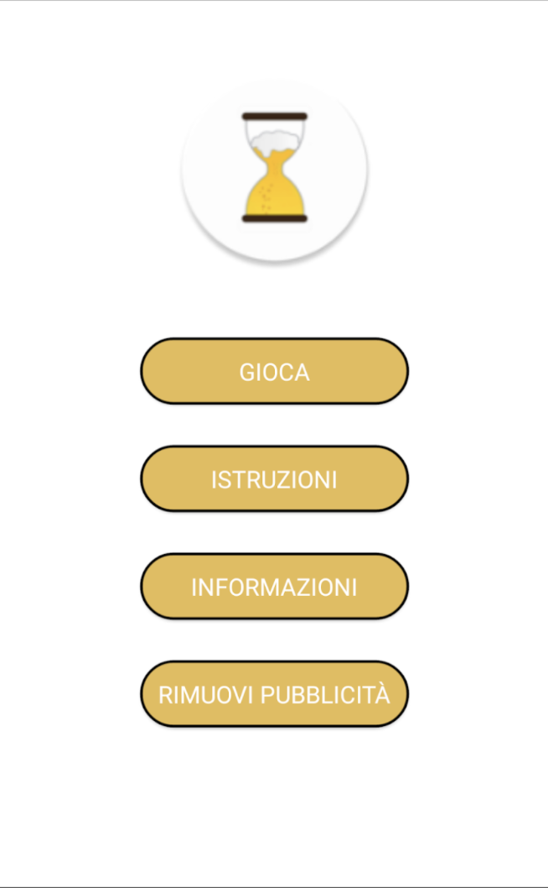
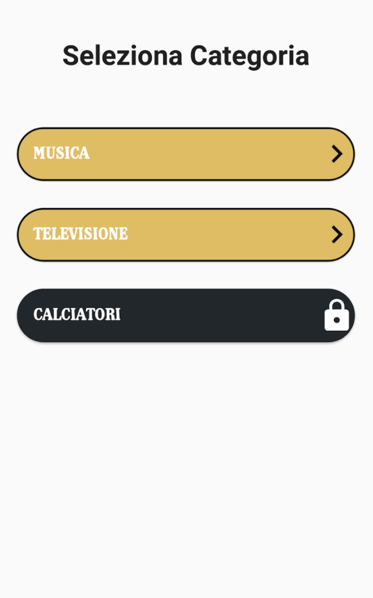
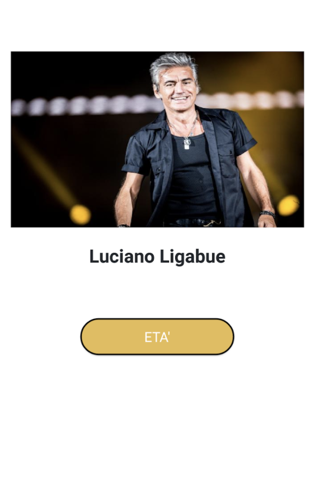
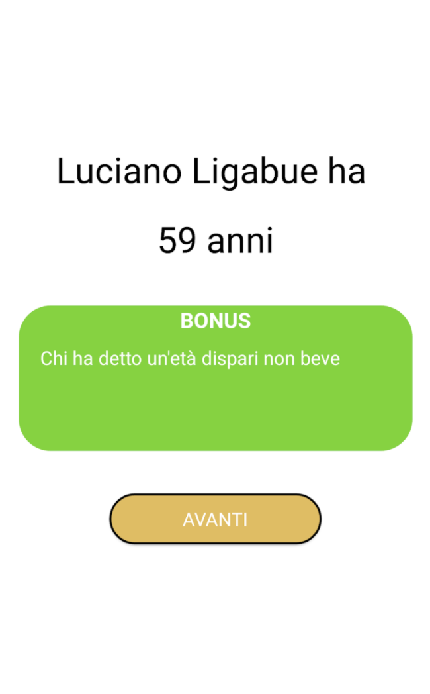

# Beverage
Android board game about guessing the age of different characters who belong to television, sport and other categories.
 
Google Play: https://cutt.ly/unSTlWE

 

  
  
  
  

#### This app has following packages:
1. **ui**: View classes along with their corresponding Presenter.
2. **data**: It contains all the data accessing and manipulating components.
3. **utils**: Utility classes.

#### This is a MVP Java Project
- I used TinyD to create a local DB to save and managed user data about questions and charcaters shown (https://tinydb.readthedocs.io/en/latest/index.html)
- I used Firebase Firestore to mantain all data.
- I used Google Mobile Ads to show banner and interstitial

 

  

