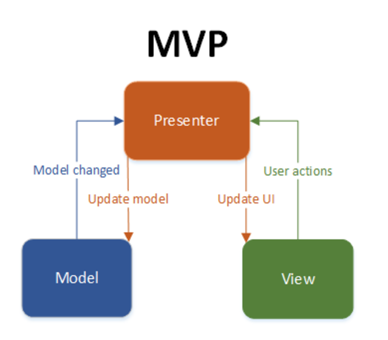

# Beverage
Android board game about guessing the age of different characters who belong to television, sport and other categories.
 
Google Play: https://cutt.ly/unSTlWE

 

  

#### This app has following packages:
1. **ui**: View classes along with their corresponding Presenter.
2. **utils**: Utility classes.

#### This is a MVC Java Project
- I used Recognizer Intent class to recognize audio and convert it to text
- I used Google Mobile Ads to show banner and interstitial

 

  

